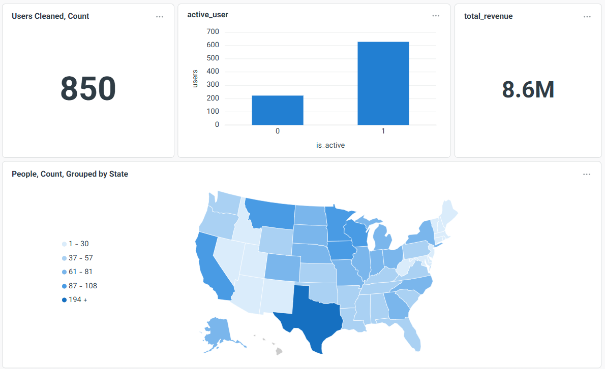

# Real-Time User Analytics Pipeline

An end-to-end data engineering project that streams synthetic user data from a PostgreSQL source through **Redpanda (Kafka-compatible)**, processes it with a **Debezium CDC connector**, stores it in **ClickHouse** (OLAP), and visualizes it in **Metabase** — all orchestrated by **Apache Airflow** inside Docker.

---

##  Architecture

```
┌─────────────────┐     INSERT      ┌─────────────┐
│  user-generator │ ─────────────▶  │   PostgreSQL DB  │   │
│  (Airflow DAG)  │                 │                       │     | raw_users    |       │
└─────────────────┘                      └────────┬─────┘
                                             │  CDC (Debezium)
                                             ▼
                                    ┌─────────────────┐
                                    │    Redpanda      │
                                    │  (Kafka-compat)  │
                                    └────────┬────────┘
                                             │  consume
                                             ▼
                                    ┌─────────────────┐
                                    │   consumer.py   │
                                    │  (Airflow DAG)  │
                                    └────────┬────────┘
                                             │  INSERT
                                             ▼
                                    ┌─────────────────┐
                                    │   ClickHouse    │
                                    │  (OLAP Store)   │
                                    └────────┬────────┘
                                             │
                                             ▼
                                    ┌─────────────────┐
                                    │    Metabase     │
                                    │  (Dashboards)   │
                                    └─────────────────┘
```

---

##  Stack

| Tool | Role |
|---|---|
| **Apache Airflow** | Orchestration — schedules producer & consumer DAGs |
| **PostgreSQL** | Source database — stores raw user records |
| **Debezium** | Change Data Capture (CDC) — streams DB changes to Kafka |
| **Redpanda** | Kafka-compatible message broker — event streaming backbone |
| **Redpanda Console** | UI for inspecting topics and messages |
| **ClickHouse** | Columnar OLAP database — stores processed events for analytics |
| **Metabase** | BI / dashboard layer on top of ClickHouse |
| **Docker Compose** | Runs the entire stack locally |

---

##  Services & Ports

| Service | Port | Description |
|---|---|---|
| Airflow UI | `8080` | DAG management |
| Redpanda (internal) | `9092` | Kafka broker (service-to-service) |
| Redpanda (external) | `29092` | Kafka broker (host access) |
| Redpanda Console | `8081` | Topic inspector UI |
| ClickHouse HTTP | `8123` | HTTP query interface |
| ClickHouse Native | `9000` | Native protocol |
| Debezium Connect | `8083` | Kafka Connect REST API |
| Debezium UI | `8085` | Connector management UI |
| Metabase | `3000` | Analytics dashboards |

---

##  Data Flow — Step by Step

### 1. Data Generation (`user-generator.py`)
An Airflow DAG runs every **1 minute** and executes `user-generator.py`, which:
- Generates a realistic fake user using the **Faker** library (identity, location, account info, analytics fields)
- Inserts the record as a JSONB payload into the PostgreSQL `raw_users` table

### 2. CDC with Debezium
Debezium monitors PostgreSQL via **logical replication** and automatically publishes every `INSERT`/`UPDATE`/`DELETE` on `raw_users` as an event to a Redpanda topic — no polling needed.

### 3. Message Broker (Redpanda)
Redpanda receives the CDC events and holds them in a topic. The broker is configured with a dual-listener setup: internal access for containers on port `9092`, and external access for the host on `29092`.

### 4. Consuming & Loading (`consumer.py`)
A second Airflow DAG runs every **10 minutes** and executes `consumer.py`, which reads batched messages from the Redpanda topic and writes them into **ClickHouse** for analytical querying.

### 5. Visualization (Metabase)
Metabase connects to ClickHouse and provides dashboards to explore user demographics, account levels, spending patterns, and risk scores.

---

##  Airflow DAGs — In Depth

The project uses two DAGs, both living in the `dags/` folder. Airflow is configured with `SequentialExecutor` — which runs one task at a time and is intentionally chosen for simplicity in a single-node dev environment. The trade-off is that tasks cannot run in parallel; for a production pipeline you would swap this for `LocalExecutor` or `CeleryExecutor`. Examples are disabled to keep the UI clean.

### DAG 1 — `user_generator_every_1min`

| Property | Value |
|---|---|
| Schedule | `*/1 * * * *` (every minute) |
| Start date | 2026-05-03 |
| Max active runs | 1 |
| Catchup | Disabled |
| Tags | `demo` |

**What it does:**
The DAG has a single task — `run_user_generator_task` — implemented as a `PythonOperator`. It calls `subprocess.run()` to execute `/opt/airflow/python/user-generator.py` inside the Airflow container. Using subprocess (rather than importing the module directly) isolates the script's environment and makes stdout/stderr clearly visible in the Airflow task logs.

```
user_generator_every_1min
└── run_user_generator_task   [PythonOperator]
        │
        └──▶ subprocess → /opt/airflow/python/user-generator.py
                  │
                  └──▶ INSERT INTO raw_users (payload) VALUES (...)
```

**Why every 1 minute?** This simulates a realistic low-volume event stream — roughly 1,440 new user records per day — giving Debezium and the consumer enough events to make the pipeline observable without overwhelming the local stack.

---

### DAG 2 — `consumer_every_10min`

| Property | Value |
|---|---|
| Schedule | `*/10 * * * *` (every 10 minutes) |
| Start date | 2026-05-04 |
| Max active runs | 1 |
| Catchup | Disabled |
| Tags | `consumer`, `kafka` |

**What it does:**
The DAG has a single task — `run_consumer_task` — also a `PythonOperator` wrapping a subprocess call to `/opt/airflow/python/consumer.py`. The consumer reads the accumulated messages from Redpanda (up to 10 minutes' worth at a time) and bulk-inserts them into ClickHouse.

```
consumer_every_10min
└── run_consumer_task   [PythonOperator]
        │
        └──▶ subprocess → /opt/airflow/python/consumer.py
                  │
                  ├──▶ KafkaConsumer(topic, bootstrap_servers="redpanda-final-project:9092")
                  │         (internal Docker network — NOT localhost)
                  └──▶ INSERT INTO ClickHouse users table
```

>  **Important:** The consumer runs inside the Docker network, so it must connect to the **internal** Redpanda listener (`redpanda-final-project:9092`), not `localhost:29092`. The external port `29092` is only for tools running on the host machine (e.g. debugging with `kcat` or a local script).

**Why every 10 minutes?** The consumer batches messages rather than processing them one-by-one. This is a deliberate micro-batch pattern — it reduces the overhead of opening and closing ClickHouse connections while still keeping the dashboard data reasonably fresh.

---

### Airflow Configuration Highlights

- **`depends_on_past: False`** — Each DAG run is fully independent. If one run fails, the next scheduled run still fires. This is important for a streaming pipeline where you never want a transient error to freeze the whole schedule.
- **`max_active_runs: 1`** — Prevents overlapping runs. If the consumer takes longer than 10 minutes (e.g. large backlog), the next trigger is skipped rather than stacking up parallel runs that would conflict on the same Kafka offset.
- **`catchup: False`** — On startup, Airflow only runs the current interval, not every missed interval since `start_date`. Essential for dev/demo environments.

---

##  Redpanda (Kafka) — In Depth

Redpanda is a Kafka-API-compatible streaming platform that replaces Kafka without requiring ZooKeeper or the JVM. In this project it acts as the central event bus between Debezium (producer) and the consumer script.

### Broker Configuration

The broker is configured with **two listeners** to handle traffic from both inside and outside the Docker network:

```yaml
--kafka-addr
  internal://0.0.0.0:9092,external://0.0.0.0:29092
--advertise-kafka-addr
  internal://redpanda-final-project:9092,external://localhost:29092
```

| Listener | Address | Used by |
|---|---|---|
| `internal` | `redpanda-final-project:9092` | Debezium, Airflow consumer (inside Docker network) |
| `external` | `localhost:29092` | Host machine tools, debugging, manual producers |

### Topic Structure

Debezium automatically creates a topic per captured table using the pattern:

```
{topic.prefix}.{schema}.{table}
```

With `topic.prefix: final`, the topic for `public.raw_users` becomes:

```
final.public.raw_users
```

Each message on this topic is a Debezium envelope — a JSON object containing the **before** and **after** state of the row, plus metadata (operation type, timestamp, source info):

```json
{
  "before": null,
  "after": {
    "id": 1,
    "payload": "{\"id\": \"uuid...\", \"first_name\": \"Alice\", ...}",
    "inserted_at": "2026-05-05T10:00:00Z"
  },
  "op": "c",
  "ts_ms": 1714900800000,
  "source": {
    "db": "final-project",
    "table": "raw_users",
    "connector": "postgresql"
  }
}
```

`op: "c"` means **create** (INSERT). Debezium also supports `u` (update), `d` (delete), and `r` (snapshot read).

### Consumer Group & Offset Management

The consumer uses Kafka's **consumer group** mechanism. Redpanda tracks the last committed offset for the group, so:
- If the consumer DAG is late or skips a run, it picks up exactly where it left off — no messages are lost.
- If you want to replay all messages from the start, reset the consumer group offset to `earliest`.

### Redpanda Console

The Console UI at `http://localhost:8081` lets you inspect everything in real time:
- Browse topics and see message counts
- Read individual messages with their key, value, headers, and offset
- Check consumer group lag (how far behind the consumer is)
- Monitor broker health and partition distribution

---

##  Metabase Dashboards

>  **Screenshot Tip:** Replace the placeholder blocks below with actual screenshots from your running Metabase instance. In Metabase, go to your dashboard → click the camera icon (or use your OS screenshot tool) → save to `assets/screenshots/` in this repo.

Add a folder to your repo:
```
assets/
└── screenshots/
    ├── dashboard-overview.png
    ├── account-levels.png
    ├── spending-by-country.png
    └── risk-score-distribution.png
```

Then reference them like this in the README (examples below):

---

### Dashboard Overview

> *Main dashboard showing real-time user counts, active users and their location.*

---

>  The table name below (`users`) should be replaced with whatever table your `consumer.py` creates in ClickHouse. Adjust the `JSONExtract` paths to match your actual column structure.

```sql
-- Account level breakdown
SELECT
    JSONExtractString(payload, 'account_level') AS account_level,
    COUNT(*) AS user_count
FROM users
GROUP BY account_level
ORDER BY user_count DESC;

-- Average spend by country
SELECT
    JSONExtractString(payload, 'country') AS country,
    ROUND(AVG(JSONExtractFloat(payload, 'total_spent')), 2) AS avg_spent,
    COUNT(*) AS user_count
FROM users
GROUP BY country
ORDER BY avg_spent DESC
LIMIT 20;

-- Risk score histogram
SELECT
    ROUND(JSONExtractFloat(payload, 'risk_score'), 1) AS risk_bucket,
    COUNT(*) AS count
FROM users
GROUP BY risk_bucket
ORDER BY risk_bucket;

-- Registration source over time
SELECT
    toDate(JSONExtractString(payload, 'created_at')) AS date,
    JSONExtractString(payload, 'registration_source') AS source,
    COUNT(*) AS signups
FROM users
GROUP BY date, source
ORDER BY date;
```

---

##  Project Structure

```
final-project/
├── Dockerfile               # Custom Airflow image with project dependencies
├── docker-file.yaml         # Docker Compose — full stack definition
├── dags/
│   ├── user-generator.py    # Airflow DAG: produce fake users every 1 min
│   └── consumer.py          # Airflow DAG: consume from Kafka every 10 min
└── python/
    ├── user-generator.py    # Core script: generate & insert fake user to Postgres
    └── consumer.py          # Core script: read from Redpanda, write to ClickHouse
```

---

##  User Schema

Each generated user record contains 30+ fields across four categories:

- **Identity** — `id`, `first_name`, `last_name`, `username`, `email`, `phone`, `dob`, `age`, `gender`, `nat`
- **Location** — `street_address`, `city`, `postal_code`, `country`, `latitude`, `longitude`, `timezone`
- **Account** — `account_level` (bronze/silver/gold/platinum), `is_active`, `is_verified`, `registration_source`, `created_at`, `last_login_at`
- **Analytics** — `total_orders`, `total_spent`, `avg_order_value`, `total_logins`, `risk_score`, `email_opt_in`

---

##  Getting Started

### Prerequisites
- Docker & Docker Compose installed
- PostgreSQL running on your host machine with a database named `final-project`
- A `raw_users` table (auto-created by the generator on first run)

### 1. Clone the repository

```bash
git clone https://github.com/your-username/final-project.git
cd final-project
```

### 2. Start the stack

```bash
docker compose -f docker-file.yaml up -d
```

This will pull and start all services. First startup may take a few minutes.

### 3. Configure Debezium

Once Debezium is healthy (check `http://localhost:8083`), register the PostgreSQL connector via the Debezium UI at `http://localhost:8085` or using the REST API:

```bash
curl -X POST http://localhost:8083/connectors \
  -H "Content-Type: application/json" \
  -d '{
    "name": "postgres-connector",
    "config": {
      "connector.class": "io.debezium.connector.postgresql.PostgresConnector",
      "database.hostname": "host.docker.internal",
      "database.port": "5432",
      "database.user": "postgres",
      "database.password": "1",
      "database.dbname": "final-project",
      "table.include.list": "public.raw_users",
      "topic.prefix": "final"
    }
  }'
```

### 4. Enable the Airflow DAGs

Open Airflow at `http://localhost:8080` and turn on:
- `user_generator_every_1min` — starts inserting fake users into Postgres
- `consumer_every_10min` — starts reading from Redpanda and writing to ClickHouse

### 5. View the data

- **Redpanda Console** → `http://localhost:8081` — inspect topics and messages live
- **Metabase** → `http://localhost:3000` — connect to ClickHouse and build dashboards

---

##  Custom Airflow Image

The `Dockerfile` extends the official Airflow image with the project's Python dependencies:

```dockerfile
FROM apache/airflow:latest

RUN pip install --no-cache-dir \
    faker \
    psycopg2-binary \
    kafka-python \
    pandas \
    requests
```

---

##  ClickHouse Credentials

| Field | Value |
|---|---|
| User | `admin` |
| Password | `123456` |
| Database | `default` |

> These are local development credentials. Do not use them in any deployed or shared environment — replace with strong passwords and ideally inject them via environment variables or Docker secrets.

---

##  Key Design Decisions

- **CDC over polling** — Using Debezium means the pipeline reacts to real database changes rather than running expensive scheduled queries against Postgres.
- **Redpanda over Kafka** — Redpanda is Kafka-compatible but runs as a single binary with no ZooKeeper dependency, making it much lighter for local development.
- **JSONB in Postgres** — The raw payload is stored as JSONB so the schema can evolve without migrations during development.
- **Airflow as orchestrator** — Even for simple scripts, wrapping them in DAGs gives visibility, retry logic, and scheduling out of the box.
- **ClickHouse for analytics** — Columnar storage makes aggregations over millions of rows (total_spent by country, risk_score distributions, etc.) extremely fast compared to row-oriented databases.

---

##  Course Context

This project was built as a final project for a **Data Engineering course**, with the goal of combining as many real-world DE tools as possible in a coherent, working pipeline — from data generation and CDC streaming, through message brokering, to OLAP storage and visualization.
